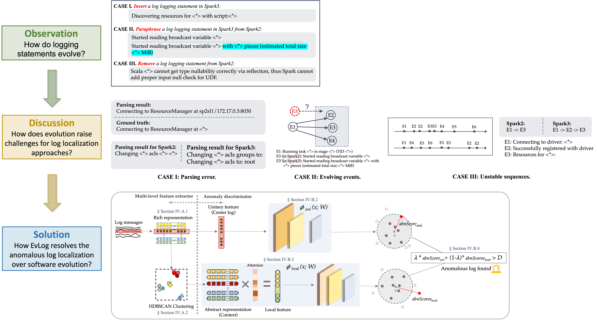

# EvLog

This is the anonymous repository for our EvLog paper submitted to ICSE'23.

## Overview



## Sample case
Considering a long sequence of logs, it is still time-consuming to analyze hundreds of log lines to find the anomalous log for troubleshooting. EvLog solves the task by identifying the anomalous log for maintainers to take the mitigation strategy appropriately.
```html
INFO org.apache.spark.executor.CoarseGrainedExecutorBackend: Got assigned task 5
INFO org.apache.spark.storage.BlockManager: Found block 46
INFO org.apache.spark.storage.BlockManager: Dropping block 46 from ...
WARN org.apache.spark.rpc.netty.NettyRpcEnv Heartbeat
INFO org.apache.spark.storage.BlockManager: 5 blocks selected for drop ...
...
INFO org.apache.spark.executor.CoarseGrainedExecutorBackend: Got assigned task 7
INFO org.apache.spark.executor.CoarseGrainedExecutorBackend: Got assigned task 8
```
EvLog then *highlights* the anomalous log message as follows:
```html
WARN org.apache.spark.rpc.netty.NettyRpcEnv Heartbeat
```


## Repository content

The content includes:
- `main.py` shows the EvLog framework with a set of customized parameters.
- `datasets/` contains the dataloader and multi-level feature extractor for rich representation and abstract representation.
- `networks/` contains the anomalous discriminator. Theoretically, this module be replaced by any neural network architecture, demonstrating the extensibility of our approach. 
- `optim/` contains the training and evaluating process.
- We also release samples of our **collected dataset** in `sampled_data/sample.pkl`. The full dataset will be released upon acceptance.
